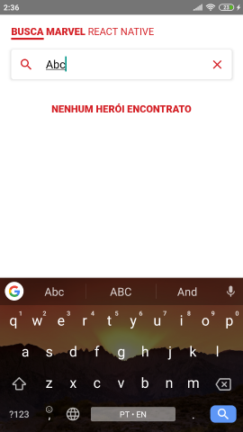

# Marvel Heroes app in React Native

## Before started

You need to create a file _.env_ in project root directory, then put PUBLIC_KEY and PRIVATE_KEY, that you can generate in [http://developer.marvel.com/](http://developer.marvel.com/).

## Features

- Search hero
- Paginate
- Heroes limit on page
- Hero modal

## Screenshots

_Home_

_Hero not found_
